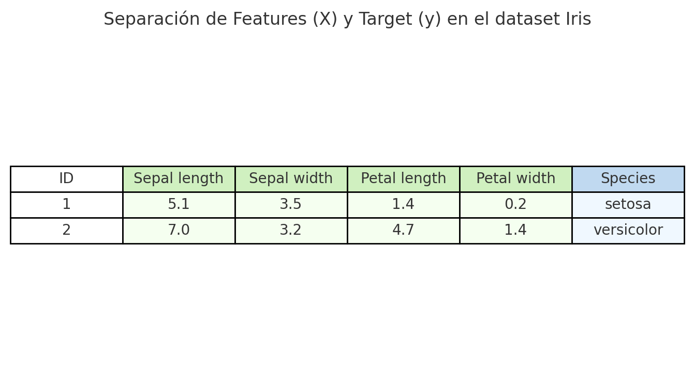

# **Clasificación de Flores de iris**

El objetivo es clasificar las flores Iris de entre las tres especies de acuerdo a longitud y ancho de sépalos y pétalos.

En **Machine Learning supervisado**, se debe separar el dataset en *features* (X) y *target* (y):

-**Features (X):** son las variables de entrada que describen las características de cada muestra (en el caso de Iris: largo y ancho de sépalo y pétalo).

-**Target (y):** es la variable que queremos predecir (en este caso, la especie de la flor).

Esta separación permite que el algoritmo de clasificación aprenda un **mapeo entre las características y la clase a la que pertenece cada observación**, de modo que luego pueda predecir la especie de nuevas flores desconocidas.

- Las **columnas verdes** representan las features: largo y ancho de sépalo, largo y ancho de pétalo.
- La **columna azul** representa el target: la especie de la flor.

1. El dataset (X, y) se divide en Train set y Test set.
2. El Train set se usa para entrenar el modelo.
3. El Test set se reserva para evaluar el rendimiento del modelo en datos no vistos.

