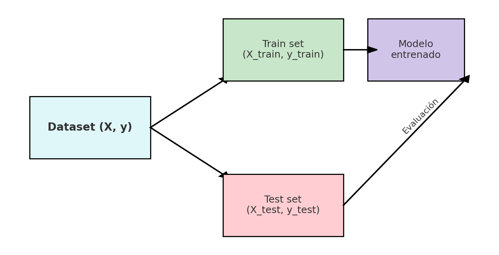

# **Clasificación de Flores de Iris / Iris Flower Classification**
--- 
El conjunto de datos Seaborn Iris es un dataset ampliamente utilizado en ciencia de datos y aprendizaje automático, especialmente para demostrar tareas de visualización y clasificación de datos. 

Contenido:

El conjunto de datos contiene mediciones de diversas características de tres especies diferentes de flores de iris. En concreto, incluye: 
- sepal_length: longitud del sépalo (en cm).
- sepal_width: ancho del sépalo (en cm).
- petal_length: longitud del pétalo (en cm).
- petal_width: ancho del pétalo (en cm).
- species: El tipo de flor de iris, que puede ser una de tres especies: Iris setosa, Iris versicolor o Iris virginica.

El objetivo es clasificar las flores Iris de entre las tres especies de acuerdo a longitud y ancho de sépalos y pétalos.

En **Machine Learning supervisado**, se debe separar el dataset en *features* (X) y *target* (y):  

- **Features (X):** son las variables de entrada que describen las características de cada muestra (en el caso de Iris: largo y ancho de sépalo y pétalo).  
- **Target (y):** es la variable que queremos predecir (en este caso, la especie de la flor).  

Esta separación permite que el algoritmo de clasificación aprenda un **mapeo entre las características y la clase a la que pertenece cada observación**, de modo que luego pueda predecir la especie de nuevas flores desconocidas.  
- Las **columnas verdes** representan las features: largo y ancho de sépalo, largo y ancho de pétalo.
- La **columna azul** representa el target: la especie de la flor.

1. El dataset (X, y) se divide en Train set y Test set.
2. El Train set se usa para entrenar el modelo.
3. El Test set se reserva para evaluar el rendimiento del modelo en datos no vistos.

