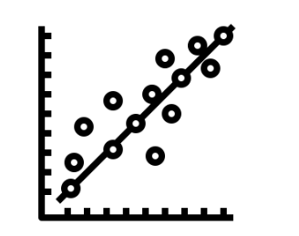
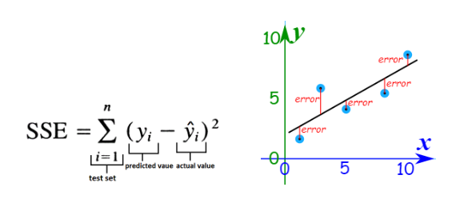

# Regresión Lineal
---

### ⚙️ Proceso de Entrenamiento de la Regresión Lineal

En este proyecto implementé **una regresión lineal simple desde cero** para predecir salarios en función de los años de experiencia.  

#### 1. Inicialización de parámetros  
- **m = 0**: pendiente de la recta
- **b = 0**: intercepción con eje Y  
- **learning_rate = 0.01**: tamaño del paso en cada iteración de optimización  
- **epochs = 1000**: cantidad de iteraciones que se realizan para ajustar el modelo  

#### 2. Variables de entrada y salida  
- **X**: variable independiente → "Experience Years" 
- **y**: variable dependiente → "Salary"
- **n**: número de observaciones en el dataset

#### 3. Función de predicción  
La fórmula de la recta es:  

    y_pred = m * X + b  

Dada una X (años de experiencia), el modelo devuelve la predicción de Y (salario)

#### 4. Función de pérdida (MSE)  
La métrica usada es el **Error Cuadrático Medio (MSE)**:  

    MSE = (1/n) * Σ (y_real - y_pred)^2  

Sirve para medir qué tan lejos están las predicciones de los valores reales  

#### 5. Gradiente descendente  
Se utiliza para encontrar los mejores valores de `m` y `b` minimizando el error:  

- Gradiente respecto a m (pendiente):  

      dm = (-2/n) * Σ [ X * (y_real - y_pred) ]  

- Gradiente respecto a b (intercepto):  

      db = (-2/n) * Σ [ (y_real - y_pred) ]  

Estos gradientes indican la dirección en la que el error disminuye más rápido

#### 6. Actualización de parámetros  
En cada iteración (epoch), se ajustan los valores de `m` y `b` en sentido contrario al gradiente:  

    m = m - learning_rate * dm  
    b = b - learning_rate * db  

donde **learning_rate** controla el tamaño del paso

#### 7. Entrenamiento  
- El proceso se repite durante `epochs` veces.  
- Cada 100 iteraciones se imprime la **pérdida (MSE)** para observar cómo va mejorando el modelo.  
- Con el tiempo, la pérdida debería **disminuir**, lo que indica que la recta se ajusta mejor a los datos.  

---
