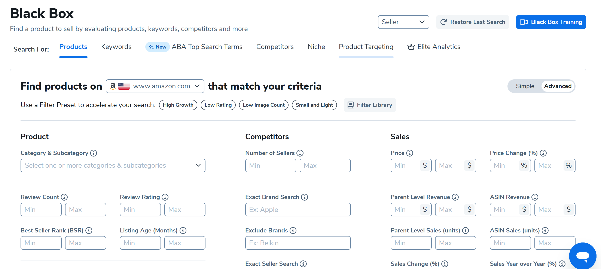
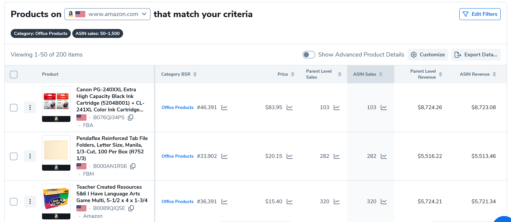

# Predicción de ventas de productos de Amazon (Helium 10)
---
Este proyecto busca predecir las **ventas de productos en Amazon** utilizando datos obtenidos de **Helium10 Blackbox**.  

## 🔹 Descripción  
Se aplicó un modelo de **regresión lineal múltiple** utilizando las siguientes variables como predictores:  
- Best Sellers Rank (BSR)  
- Price  
- Review Count  
- Reviews Rating  
- Number of Images  
- Variation Count  
- Age (Month)  

---

## 🔹 Resultados  
- **MAE:** 241.25  
- **RMSE:** 374.21  
- **R²:** -1.01  
- **CV RMSE mean:** 268.02  

El modelo mostró un **ajuste deficiente** (R² negativo), lo que indica que las variables utilizadas no logran explicar de manera adecuada las ventas, y que la regresión lineal múltiple no es el método más apropiado para este dataset.  

---

 Este proyecto sirve como punto de partida para explorar cómo la **calidad del dataset** y la **elección del modelo** influyen directamente en el desempeño de un sistema de Machine Learning.  
 